# Лабораторная работа 5

## Задание 1 - Автоматизация проверки формата файлов при коммите

Создаем новый файл с проверкой в `.git/hooks`:

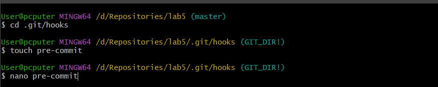

Наполняем его содержимым например проверкой на пустоту файла:

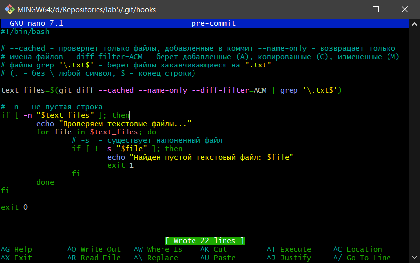

Пробуем добавить пустой текстовый файл:

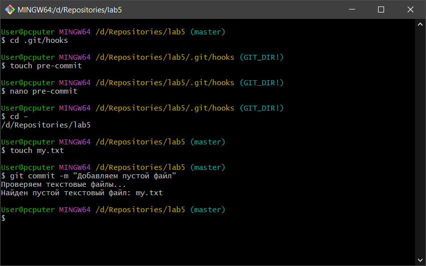
В коммите отказано.

Заполняем файл и коммитим снова:

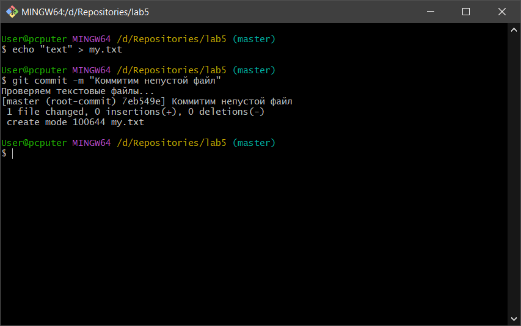
Коммит удался.

__Вывод: скрипт работает__

## Задание 2 - Использование Git Flow в проекте

## Feature
Инициализируем создаем фичу git-flow:

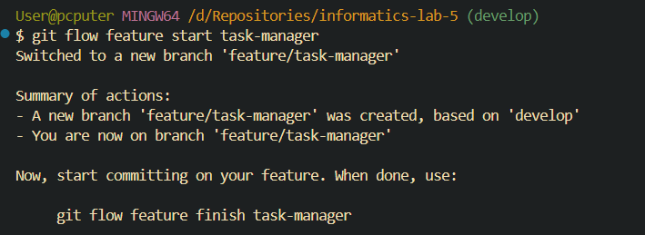

Теперь наполняем ее содержимым и соединяем обратно с нашей веткой `develop`:

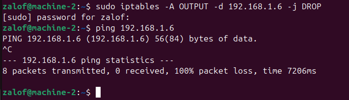

## Release

Создаем релиз:

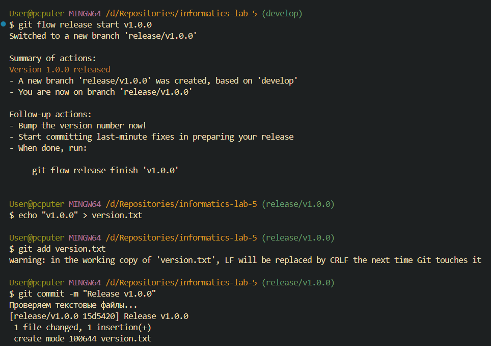

Выпускаем релиз:

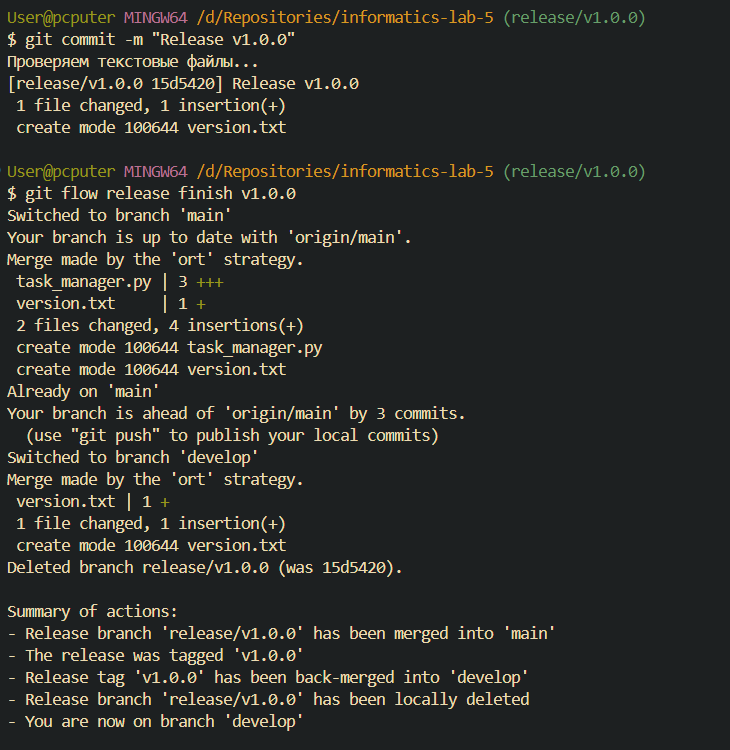

## Hotfix

Делаем хотфикс:

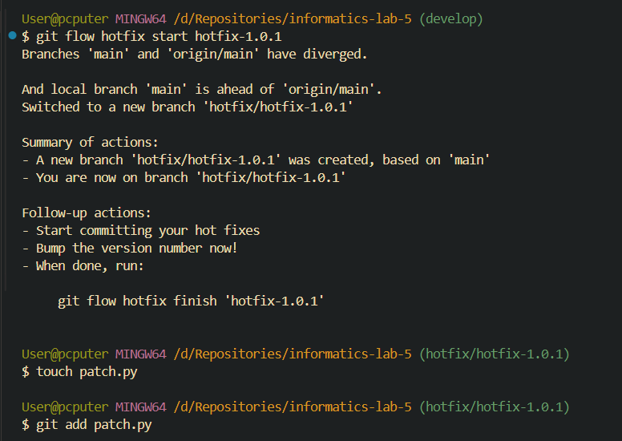

Завершаем работу над хотфиксом:

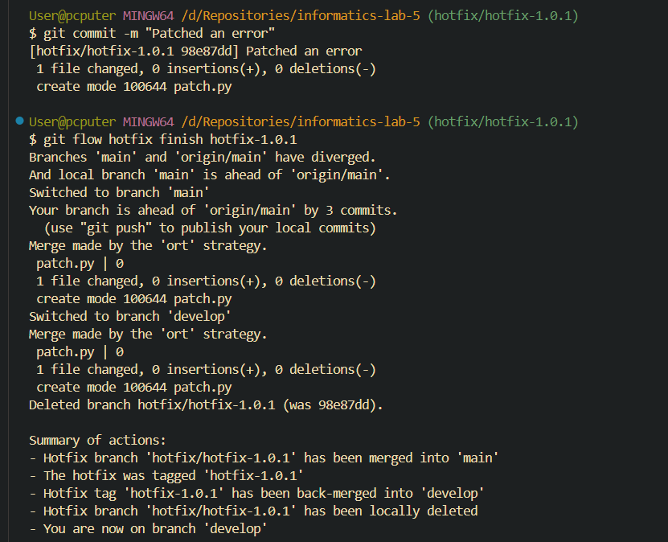

## Push

Пушим изменения на репозиторий:

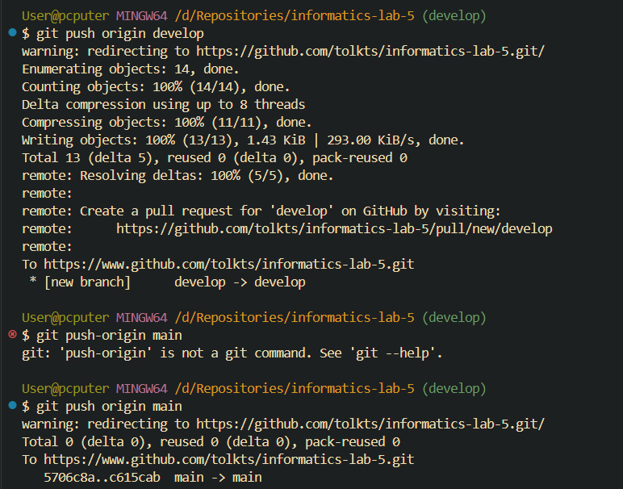

